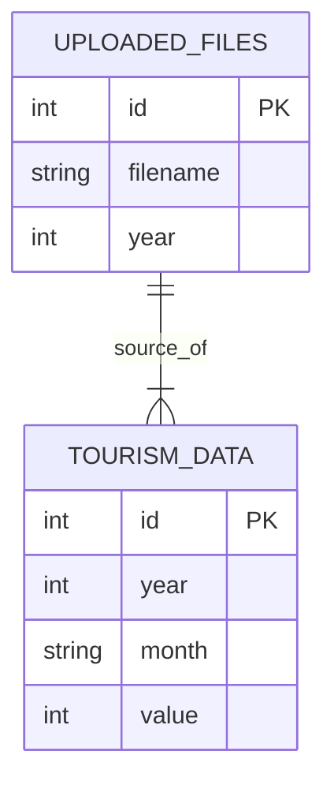

# Analisis Sistem Website Data Pariwisata (Untuk Bab 4)

Dokumen ini berisi analisis detail mengenai sistem website yang telah dibangun, disusun untuk memenuhi kebutuhan penulisan Bab 4 Laporan Akhir.

## 1. Fungsi Utama, Tujuan, dan Masalah yang Diselesaikan

*   **Fungsi Utama**: Website ini berfungsi sebagai **Sistem Manajemen dan Analisis Data Pariwisata**. Fungsi intinya adalah mendigitalisasi proses pengumpulan, penyimpanan, visualisasi, dan analisis data kunjungan wisatawan (Nusantara dan Mancanegara) di Kota Palembang.
*   **Tujuan Pembuatan**:
    1.  Memudahkan Dinas Pariwisata dalam mengelola data kunjungan yang sebelumnya mungkin manual.
    2.  Menyediakan visualisasi data otomatis (Grafik/Chart) untuk pemantauan tren.
    3.  Memberikan wawasan (insight) berbasis *Machine Learning* untuk menentukan strategi pemasaran berdasarkan musim (High/Low Season).
*   **Masalah yang Diselesaikan**:
    *   **Manual Data Entry**: Menggantikan rekapitulasi manual dengan fitur Upload (CSV/PDF).
    *   **Analisis Lambat**: Mengotomatisasi perhitungan statistik dan tren yang sebelumnya memakan waktu.
    *   **Kurangnya Insight**: Memberikan rekomendasi berbasis data (data-driven) menggunakan algoritma K-Means Clustering, bukan sekadar asumsi.

## 2. Arsitektur Sistem

Sistem ini menggunakan arsitektur **MVC (Model-View-Controller)** sederhana yang diimplementasikan menggunakan framework Flask.

*   **Frontend (View)**:
    *   Dibangun menggunakan **HTML5, CSS (Bootstrap), dan JavaScript**.
    *   Menggunakan **Jinja2 Templating Engine** untuk merender data dinamis dari backend ke halaman HTML.
    *   Interaksi pengguna dilakukan melalui browser.
*   **Backend (Controller)**:
    *   Dibangun menggunakan bahasa **Python** dengan framework **Flask**.
    *   Berfungsi menerima request dari user (Upload, Delete, View Dashboard), memproses logika bisnis (Validasi, Analisis ML), dan mengirimkan respon balik.
*   **Database (Model)**:
    *   Menggunakan **SQLite** (`tourism.db`) sebagai penyimpanan data relasional.
    *   Menyimpan data mentah pariwisata dan riwayat file yang diupload.

### Alur Komunikasi (Diagram Teks)

```mermaid
graph LR
    User[Pengguna] -- HTTP Request --> Flask[Backend (App.py)]
    Flask -- Query/Insert --> DB[(Database SQLite)]
    DB -- Result Data --> Flask
    Flask -- Processing/ML --> Pandas[Pandas & Scikit-Learn]
    Pandas -- Analysis Result --> Flask
    Flask -- Render Template --> HTML[Frontend (Jinja2)]
    HTML -- HTTP Response --> User
```

## 3. Identifikasi Fitur dan Modul

Berdasarkan analisis kode sumber, berikut adalah modul dan fitur yang tersedia dalam sistem.
*Catatan: Saat ini sistem **TIDAK** memiliki Modul Login/Autentikasi. Semua pengguna memiliki akses penuh sebagai Admin.*

### A. Modul Manajemen Data (Input)
Fitur ini menangani pemasukan data ke dalam sistem.
1.  **Upload CSV**: Memungkinkan pengguna mengunggah data kunjungan tahunan dalam format `.csv`. Sistem otomatis mendeteksi baris data "Palembang".
2.  **Upload PDF**: Menggunakan `pdf_processor.py` (berbasis `pdfplumber`) untuk mengekstrak tabel data kunjungan langsung dari laporan PDF dinas.
3.  **Validasi Data**: Memastikan tahun valid (2000-Tahun Depan) dan format file benar.

### B. Modul Dashboard & Visualisasi
Fitur ini menampilkan hasil pengolahan data kepada pengguna.
1.  **Kartu Statistik**: Menampilkan Total Pengunjung, Rata-rata, Pertumbuhan, dll.
2.  **Chart Generator**:
    *   Grafik Batang (Bulanan).
    *   Grafik Garis (Trend Tahunan).
    *   Pie Chart (Distribusi Musim).
    *   Grafik Perbandingan Tahun (Year-over-Year).
    *   *Teknologi*: Grafik digenerasi di backend menggunakan `Matplotlib` dan dikirim sebagai gambar statis (PNG) ke frontend.

### C. Modul Analisis Cerdas (Machine Learning)
Fitur unggulan untuk memberikan nilai tambah analisis.
1.  **Clustering Musim**: Menggunakan algoritma **K-Means Clustering** (Scikit-Learn) untuk mengelompokkan bulan ke dalam kategori *High*, *Medium*, dan *Low Season*.
2.  **Analisis Trend**: Menghitung persentase kenaikan/penurunan dibanding tahun sebelumnya.
3.  **Sistem Rekomendasi**: Memberikan saran strategis otomatis (generated text) berdasarkan hasil pola data yang ditemukan (misal: "Fokus promosi digital saat Low Season").

### D. Modul Laporan (Output)
1.  **Ekspor Excel**: Mengunduh seluruh data lengkap dengan hasil analisis ML dan grafik yang ditempelkan di dalam file Excel (`.xlsx`). Menggunakan library `openpyxl`.

### E. Modul Utilitas
1.  **Reset Data**: Fitur untuk menghapus seluruh data di database (`DELETE FROM`) untuk memulai ulang.

---

## 4. Analisis Struktur Database

Database menggunakan **SQLite**. Berikut adalah skema tabelnya:

### Tabel 1: `tourism_data`
Menyimpan data data inti kunjungan per bulan.

| Atribut | Tipe Data | Keterangan |
| :--- | :--- | :--- |
| `id` | INTEGER | **Primary Key**, Auto Increment |
| `year` | INTEGER | Tahun data (misal: 2023) |
| `month` | TEXT | Nama bulan (Full English name) |
| `value` | INTEGER | Jumlah pengunjung |
| `created_at` | TIMESTAMP | Waktu data dimasukkan |

### Tabel 2: `uploaded_files`
Menyimpan riwayat file yang pernah diupload (untuk audit trail sederhana).

| Atribut | Tipe Data | Keterangan |
| :--- | :--- | :--- |
| `id` | INTEGER | **Primary Key**, Auto Increment |
| `filename` | TEXT | Nama file fisik yang disimpan |
| `year` | INTEGER | Tahun data dalam file tersebut |
| `upload_date`| TIMESTAMP | Waktu upload |

### Relasi Antar Tabel (ERD Teks)
Secara teknis di database SQLite saat ini **tidak ada Foreign Key constraint** yang mengikat kedua tabel ini secara keras (fisik). Hubungannya bersifat logis (implisit).

*   **Logika**: 1 File Upload berisi data untuk 1 Tahun tertentu (misal 12 baris bulan).
*   **Relasi**: 1-to-Many (logis). Satu record di `uploaded_files` merepresentasikan sumber dari banyak baris di `tourism_data` untuk tahun yang sama.



## 5. Alur Proses Utama

Karena tidak ada login, alur User dan Admin adalah sama.

### Alur 1: Input Data (Upload)
1.  Pengguna membuka menu **Upload**.
2.  Pengguna memilih file (CSV atau PDF) dan memasukkan **Tahun Data**.
3.  Sistem menerima file -> Validasi format & tahun.
4.  **Parsing**:
    *   Jika CSV: `pandas` membaca file, mencari baris "Palembang".
    *   Jika PDF: `pdfplumber` mengekstrak tabel teks, mencari kolom "Bulan" dan "Total".
5.  **Save**: Data bulan & nilai disimpan ke tabel `tourism_data`.
6.  **Log**: Informasi file disimpan ke `uploaded_files`.
7.  Sistem me-redirect ke halaman Upload dengan pesan "Sukses".

### Alur 2: Analisis & Dashboard
1.  Pengguna membuka menu **Dashboard**.
2.  Sistem (`analyze_data()`) mengambil seluruh data dari `tourism_data`.
3.  **Preprocessing**: Data diurutkan berdasarkan Tahun dan Bulan.
4.  **Aggregating**: Menghitung total tahunan dan rata-rata.
5.  **ML Processing**:
    *   Data rata-rata bulanan dikirim ke `TourismAnalyzer`.
    *   Algoritma K-Means dijalankan untuk melabeli bulan (High/Med/Low).
6.  **Visualization**: `ChartGenerator` membuat plot gambar (PNG) menggunakan Matplotlib.
7.  Halaman Dashboard dirender dengan angka statistik + gambar grafik.

## 6. Implementasi Program

*   **Bahasa Pemrograman**: Python 3.x
*   **Framework Web**: Flask (Microframework).
*   **Penyimpanan**: SQLite 3.
*   **Library Analisis Data**:
    *   `Pandas`: Manipulasi tabel data.
    *   `NumPy`: Operasi numerik.
    *   `Scikit-Learn`: Algoritma Machine Learning (K-Means Clustering, Silhouette Score, StandardScaler).
*   **Library Visualisasi**: `Matplotlib` (Backend Agg) untuk generate chart statis.
*   **Pemrosesan Dokumen**:
    *   `pdfplumber`: Ekstraksi data tabel dari PDF.
    *   `openpyxl`: Pembuatan laporan Excel (.xlsx).

## 7. Analisis Kelebihan dan Keterbatasan

### Kelebihan (Fungsional & Teknis)
1.  **Dukungan Multi-Format**: Mampu mengolah data langsung dari PDF (yang merupakan format umum laporan dinas) selain CSV.
2.  **Analisis Cerdas**: Tidak hanya menampilkan data mentah, tapi memberikan **interpretasi** (Clustering Musim) yang membantu pengambilan keputusan.
3.  **Portable**: Menggunakan SQLite memudahkan deployment tanpa setup server database berat (MySQL/PostgreSQL).
4.  **Export Lengkap**: Laporan Excel yang dihasilkan sangat komprehensif, termasuk menyisipkan gambar grafik di dalamnya (bukan hanya angka).

### Keterbatasan (Limitasi)
1.  **Tidak Ada Otentikasi (Critical)**: Sistem belum memiliki fitur Login. Siapapun yang mengakses URL bisa menghapus data.
2.  **Skalabilitas Database**: SQLite cocok untuk data skala kecil-menengah. Jika data bertambah hingga jutaan baris, performa akan menurun dibanding MySQL.
3.  **Visualisasi Statis**: Grafik dirender sebagai Gambar (PNG) di sisi server (Server-Side Rendering). Ini berarti grafik tidak interaktif (tidak bisa di-hover untuk lihat angka detail) dibandingkan chart berbasis JavaScript (seperti Chart.js).
4.  **Validasi PDF Kaku**: Ekstraksi PDF sangat bergantung pada format tabel yang spesifik. Jika Dinas mengubah format laporan PDF, ekstraksi mungkin gagal.
